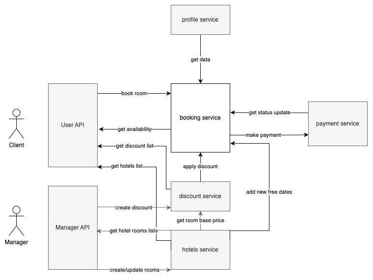

# Documentation

Considering the fact that requirements were a little wide, I've managed to make some decisions on system design by myself. See the diagram below.

## System design

I have attempted to implement system context and component diagrams of [c4 model](https://c4model.com/) to visualize and better understand what I am dealing with.

This is the most abstract layer. [Component diagram](component.md) is more focused on booking.

Let's imagine that we have a complete hotel booking web app with issues in booking service, but what other components do we have?

### 1. Payment Service
Booking service surely will have a close relationship with some payment service. Maybe it will not accept reservations which have not been paid for a long time since creation. Reservation status will strictly depend on payment status.

### 2. Discount Service
Requirements says that the booking service has the ability to apply some discounts on new reservations. How will they work?

Discounts divide into groups by their strategy. Different strategies requires different initial order information and provides function to calculate their effect on price.

I have assumed a manager web interface where he can create temporary discount campaigns of any type. They will have different appearance, lifecycle and conditions (like discount for the very first reservation on a new kind of room). So additional service is needed.

### 3. Hotels service
It will be nice to have service with all public information about hotels: room types and prices, payment options, extra features, etc...

### 4. Our booking service
It will handle requests on room availability and the reservation creating process. This is what we are building here.

### Also
5. Profile service with user profile data. May be helpful to store user payment preferences and metrics which will be used by discount service.
6. Backend services which will handle requests from frontend. They will take authorization responsibilities.

