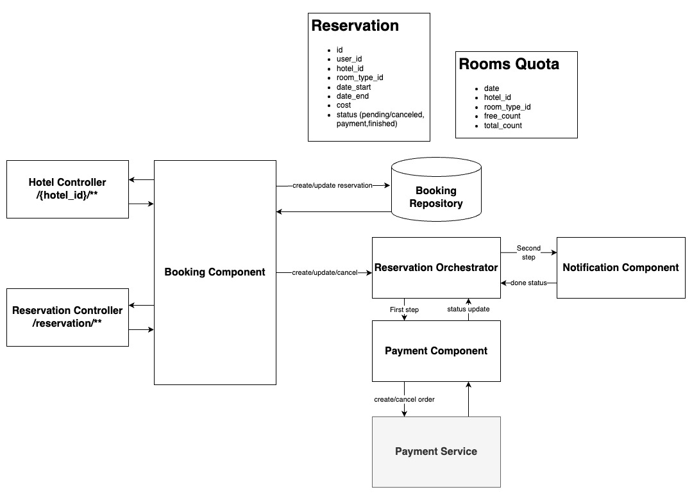

# Component layer

### Usecase

We will have to make many actions as part of reservation process. I was need some real life usecase of advanced reservation process and I've came up with this: 
```
1. Guest user make reservation on our web app.
2. We need to check if hotel and room of his choice would be free at given dates.
2. Then if they are, we have to reserve them from being overbooked.
3. After that we may have a requirement to register this user, in other case we have to cancel the reservation.
4. After he is registered he may need to add payment preferences and only then we send request to his accounting provider.
```

### Problem

It seems like we have bunch of services that asynchronously update reservation. Booking service would be kind of orchestrator to them. It will ensure that transactions are completely finished and system is consistent despite services partial failures. If it answer OK to client and then fail, it need to be responsible to continue it work.

### Solution

I need to implement [Saga pattern](https://microservices.io/patterns/data/saga.html) to make sure that reservation transaction is working properly. I prefer to make it orchestration-based, because at the end it would be easier to dynamically configure steps of transaction for each request personally, that may be needed when the system grows.



This is a very brief visualization of my thoughts about app layers and data model. Here I just show the most complicated parts of application to think about.

### Domain model

- **Reservation** represents transaction and contains its status. At first revision I will use one storage for all data, but then it will be splitted up to transaction data and anything else we need to know about reservation.
- **RoomAvailability** contains available rooms count by it type and hotel id


